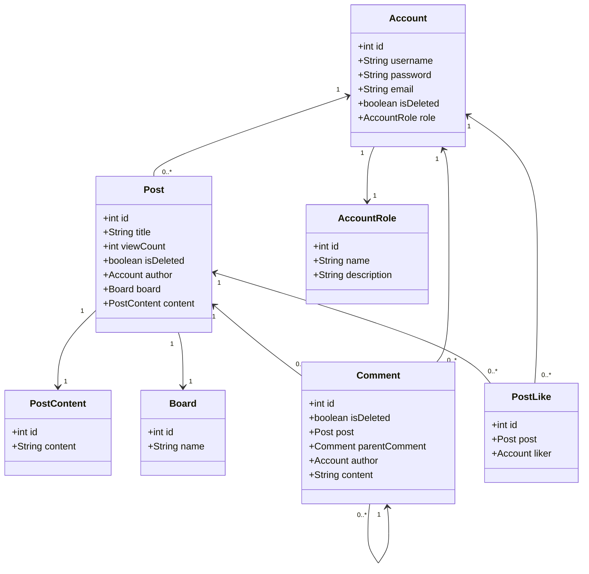

# Basic Board

## ERD

```mermaid
classDiagram
    class Account {
        +int id
        +String username
        +String password
        +String email
        +boolean isDeleted
        +AccountRole role
    }

    class Post {
        +int id
        +String title
        +int viewCount
        +boolean isDeleted
        +Account author
        +Board board
        +PostContent content
    }

    class PostContent {
        +int id
        +String content
    }

    class Board {
        +int id
        +String name
    }

    class Comment {
        +int id
        +boolean isDeleted
        +Post post
        +Comment parentComment
        +Account author
        +String content
    }

    class PostLike {
        +int id
        +Post post
        +Account liker
    }

    class AccountRole {
        +int id
        +String name
        +String description
    }

    Account "1" <-- "0..*" Post
    Account "1" <-- "0..*" Comment
    Account "1" <-- "0..*" PostLike
    Account "1" --> "1" AccountRole
    Post "1" --> "1" PostContent
    Post "1" <-- "0..*" Comment
    Post "1" <-- "0..*" PostLike
    Post "1" --> "1" Board
    Comment "1" <-- "0..*" Comment

```