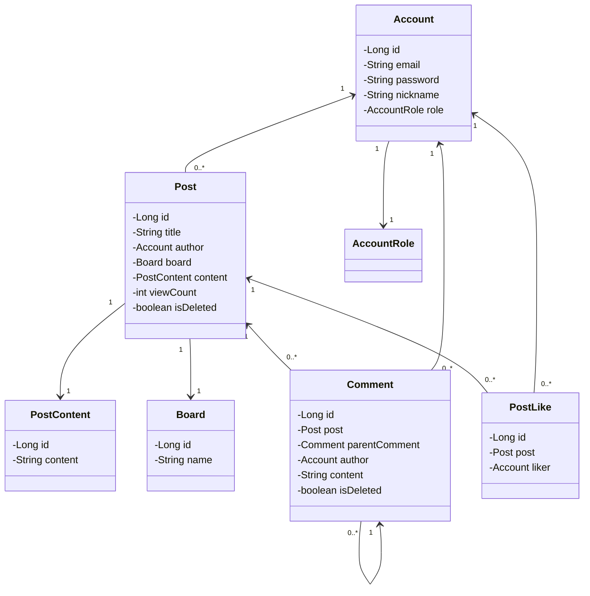

# Basic Board

## ERD



## 테이블 생성

### Account

<details>

```sql
CREATE TABLE account (
    id BIGINT PRIMARY KEY AUTO_INCREMENT,
    email VARCHAR(255) NOT NULL,
    password VARCHAR(255) NOT NULL,
    nickname VARCHAR(255),
    role VARCHAR(255),
    create_time TIMESTAMP,
    modified_time TIMESTAMP
);
```

</details>

### Post

<details>

```sql
CREATE TABLE post (
    id BIGINT PRIMARY KEY,
    title VARCHAR(255),
    content_id BIGINT,
    author_id BIGINT,
    board_id BIGINT,
    view_count INT DEFAULT 0,
    is_deleted BOOLEAN DEFAULT FALSE,
    create_time TIMESTAMP,
    modified_time TIMESTAMP
);
```

</details>

### PostContent

<details>

```sql
CREATE TABLE post_content (
    id BIGINT PRIMARY KEY,
    content VARCHAR(1000)
);
```

</details>

### PostLike

<details>

```sql
CREATE TABLE post_like (
    id BIGINT PRIMARY KEY,
    post_id BIGINT,
    liker_id BIGINT,
    create_time TIMESTAMP,
    modified_time TIMESTAMP
);

```

</details>

<details>

```sql
CREATE TABLE board (
    id BIGINT PRIMARY KEY,
    name VARCHAR(255),
    create_time TIMESTAMP,
    modified_time TIMESTAMP
);
```

</details>

<details>

```sql
CREATE TABLE comment (
    id BIGINT PRIMARY KEY,
    content TEXT,
    post_id BIGINT,
    author_id BIGINT,
    parent_comment_id BIGINT,
    is_deleted BOOLEAN DEFAULT FALSE,
    create_time TIMESTAMP,
    modified_time TIMESTAMP
);
```
</details>