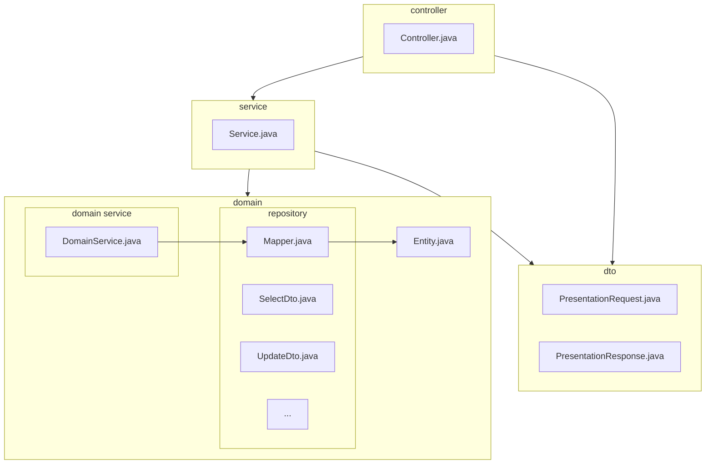

# Basic Board

## 소개

웹 개발의 기본이라 불리는 게시판 프로젝트를 진행했습니다.
이 프로젝트에서는 독학으로 배웠던 기술들을 사용해보고 익숙해지는 것을 목표로 하였습니다.
특히 Spring Security, Mybatis, 그리고 jQuery, Bootstrap에 초점을 맞추었습니다.

### 1. 프로젝트 주요 기능

- **Board**
  - [Board 별 게시글 조회](#41-board-별-게시글-조회)
- **Post**
  - [CRUD](#42-post-crud)
  - [좋아요, 조회수](#43-좋아요조회수)
- **Comment**
  - [무한 답글](#44-무한-답글)
- **Account**
  - [회원가입, 로그인, 로그아웃](#45-회원가입로그인로그아웃)

### 2. 주요 사용 기술

**[백엔드]**

- Java 11
- SpringBoot 2.7.13
- Mybatis 2.3.1
- Spring Security 5.7.9

**[프론트엔드]**

- Html/Css
- jQuery
- Thymeleaf
- Bootstrap 5.2.3

### 3. 개발 기간

- 2023.06.28 ~ 2023.07.06

## 4. 상세 구현 내용

↓ 토글 버튼을 누르면 펼쳐볼 수 있습니다.

<details>

<summary>프로젝트 기능 상세</summary>

### 4.1 Board 별 게시글 조회

Board 페이지에서는 각 Board에 소속 된 Post 목록을 보여줍니다.
이 프로젝트에서는 "자유게시판"과 "FAQ"를 name으로 갖는 Board가 있습니다.

테이블의 각 Post는 로그인한 사용자가 해당 Post에 "좋아요"를 눌렀는지와 기본 Post 정보를 표시합니다.


### 4.2 Post CRUD

[게시글 조회]


[게시글 작성]


[게시글 수정]


[게시글 삭제]

이미지는 없지만, 삭제를 누르면 Post를 soft delet하여 조회 시에 제외합니다.

### 4.3 좋아요/조회수

PostLike 테이블에서 `post_id`와 `post_liker`를 묶어 Unique를 지정하여 "좋아요" 중복을 방지했습니다.

PostContent를 포함하여 조회 시에는 조회수가 증가하도록 했습니다.


### 4.4 무한 답글

DB는 간단하게 자식 Comment가 부모 Comment의 Id를 fk로 보유하도록하고, 댓글 조회 시 해당 Post에 속하는 댓글(post_id)을 전부 전달합니다.

Ajax로 comment 리스트를 받은 jQuery가 재귀적인 방식으로 comment를 정렬하여 표시합니다.


### 4.5 회원가입/로그인/로그아웃

> "회원가입, 로그인, 로그아웃"에 대한 이미지는 간단하게 `email`, `password`를 받는 형태여서 제외했습니다.
> 대신 각 기능이 어떤 식으로 구현되었는지 상세 설명을 남기겠습니다.

[회원가입]

입력된 email과 bcrypt로 암호화된 password를 저장합니다.

[로그인]

로그인은 form 방식을 사용하지 않고, ajax 방식으로 `email`, `password`를 전달하여 로그인하도록 했습니다. (학습 목적)

로그인은 다음의 순서로 인증이 진행 됩니다.

1. `AjaxLoginProcessingFilter`
  - 로그인 인증을 위해 입력 된 데이터 자체를 검증 후 `EmailPasswordAuthenticationToken`를 생성하여 인증을 진행합니다.
2. `AuthenticationManager`
3. `CustomAuthenticationProvider`
  - 3.1 인증 전의 `EmailPasswordAuthenticationToken`(Authentication)을 받습니다.
  - 3.2 `CustomUserDetailsService`로부터 로그인 정보를 포함하는 `CustomUserDetails`를 받아 로그인을 검증합니다.
  - 3.3 인증이 완료 된 새로운 `EmailPasswordAuthenticationToken` 생성합니다.
    
    -> 인증 후의 Authentication은 다른 클래스를 사용해도 좋을 듯 하지만, 이 프로젝트에서는 인증 전과 동일한 Authentication을 사용했습니다.

[로그아웃]

특정 URL(`/api/v1/logout-proc`)으로 Get 요청이 들어오면 세션과 세션 쿠키를 삭제합니다.

</details>


## 구조 및 설계

### 1. 패키지 구조

> 이번 프로젝트에서는 Mybatis를 사용하면서, JPA를 사용했을 때의 패키지 구조와는 다르게 정리했습니다.

JPA를 사용해서 테이블의 엔티티를 조회하거나 업데이트 할 때는 별도의 Dto를 사용하지 않았고, 관련된 클래스 파일도 많지 않았습니다.

그래서 `repository` 폴더를 따로 구분하지 않고 `domain` 폴더에 두었었습니다.

<summary>JPA - 패키지 구조</summary>

```
📦reservation
 ┣ 📂controller
 ┣ 📂domain
 ┣ 📂dto
 ┣ 📂exception
 ┗ 📂infra
   ┗ 📂validator
 ┗ 📂service

```

그런데 Mybatis를 사용하니 Mapper를 통해 엔티티를 조회하거나 업데이트 할 때, 조건이나 필드 값을 갖는 `EditPostDto.java`와 같은 `Parameter Object(dto)`들이 많이 필요했습니다.
그래서 `repository` 폴더로 구분을 해야할 필요성을 느껴 추가하게 되었습니다.

처음에는 `domain` 폴더 밖으로 `repository` 폴더를 추가하려 했습니다.
하지만 `repository`는 필연적으로 `domain`의 엔티티 클래스를 의존하고 **(repository->domain)**,
`domain`의 도메인 서비스들도 `repository`를 의존하니 **(domain->repository)**, <U>패키지 의존성 순환</U>이 발생했습니다.

그래서 도메인 서비스가 도메인 밖으로 나올 수 없으니 `repository`폴더를 `domain` 폴더 내부로 옮겼습니다. 
하지만 여전히 도메인 서비스 클래스들과 `domain.repository` 폴더 간에 의존성 순환이 남아 있었습니다.

최종적으로 도메인 서비스 클래스들을 `domain.service`로 옮겨 구조적인 의존성 순환을 해결했습니다.

<summary>Mybatis - 패키지 구조 및 의존성</summary>

[패키지 구조]

```
📂post
 ┣ 📂controller
 ┣ 📂domain
 ┃ ┣ 📂repository
 ┃ ┗ 📂service
 ┣ 📂dto
 ┗ 📂service
```

[의존성]



<details>

<summary>Mybatis - 전체 File Tree</summary>

```
📂main.java.study.board
┣ 📂account
┃ ┣ 📂controller
┃ ┃ ┣ 📜AccountController.java
┃ ┃ ┗ 📜AccountRestController.java
┃ ┣ 📂domain
┃ ┃ ┣ 📂repository
┃ ┃ ┃ ┗ 📜AccountMapper.java
┃ ┃ ┣ 📂service
┃ ┃ ┃ ┗ 📜AccountFinder.java
┃ ┃ ┣ 📜Account.java
┃ ┃ ┗ 📜AccountRole.java
┃ ┣ 📂dto
┃ ┃ ┣ 📜LoginReq.java
┃ ┃ ┣ 📜SignupReq.java
┃ ┃ ┗ 📜UserProfile.java
┃ ┗ 📂service
┃ ┃ ┗ 📜AccountService.java
┣ 📂board
┃ ┣ 📂controller
┃ ┃ ┗ 📜BoardController.java
┃ ┗ 📂domain
┃ ┃ ┣ 📂repository
┃ ┃ ┃ ┗ 📜BoardMapper.java
┃ ┃ ┣ 📂service
┃ ┃ ┃ ┗ 📜BoardFinder.java
┃ ┃ ┗ 📜Board.java
┣ 📂comment
┃ ┣ 📂controller
┃ ┃ ┗ 📜CommentRestController.java
┃ ┣ 📂domain
┃ ┃ ┣ 📂repository
┃ ┃ ┃ ┣ 📜CommentAndAuthorNameDto.java
┃ ┃ ┃ ┗ 📜CommentMapper.java
┃ ┃ ┣ 📂service
┃ ┃ ┃ ┗ 📜CommentFinder.java
┃ ┃ ┗ 📜Comment.java
┃ ┣ 📂dto
┃ ┃ ┣ 📜CommentReq.java
┃ ┃ ┣ 📜CommentResp.java
┃ ┃ ┗ 📜SubmitCommentReq.java
┃ ┗ 📂service
┃ ┃ ┗ 📜CommentService.java
┣ 📂common
┃ ┣ 📂authentication
┃ ┃ ┣ 📜LoginUser.java
┃ ┃ ┗ 📜LoginUserArgumentResolver.java
┃ ┗ 📂controller
┃ ┃ ┗ 📜HomeController.java
┣ 📂config
┃ ┣ 📂security
┃ ┃ ┣ 📂Authentication
┃ ┃ ┃ ┣ 📜AjaxLoginProcessingFilter.java
┃ ┃ ┃ ┣ 📜AuthenticationBeans.java
┃ ┃ ┃ ┣ 📜CustomAuthenticationProvider.java
┃ ┃ ┃ ┗ 📜PasswordEncoderConfig.java
┃ ┃ ┣ 📂dto
┃ ┃ ┃ ┣ 📜CustomUserDetails.java
┃ ┃ ┃ ┗ 📜EmailPasswordAuthenticationToken.java
┃ ┃ ┗ 📂service
┃ ┃ ┃ ┗ 📜CustomUserDetailsService.java
┃ ┣ 📜SecurityConfig.java
┃ ┗ 📜WebConfig.java
┣ 📂post
┃ ┣ 📂controller
┃ ┃ ┣ 📜PostController.java
┃ ┃ ┗ 📜PostRestController.java
┃ ┣ 📂domain
┃ ┃ ┣ 📂repository
┃ ┃ ┃ ┣ 📜DeletePostDto.java
┃ ┃ ┃ ┣ 📜DeletePostLikeDto.java
┃ ┃ ┃ ┣ 📜EditPostContentDto.java
┃ ┃ ┃ ┣ 📜EditPostDto.java
┃ ┃ ┃ ┣ 📜PostContentMapper.java
┃ ┃ ┃ ┣ 📜PostLikeMapper.java
┃ ┃ ┃ ┣ 📜PostMapper.java
┃ ┃ ┃ ┗ 📜SelectPostLikeDto.java
┃ ┃ ┣ 📂service
┃ ┃ ┃ ┣ 📜PostEditor.java
┃ ┃ ┃ ┣ 📜PostFinder.java
┃ ┃ ┃ ┗ 📜PostInfo.java
┃ ┃ ┣ 📜Post.java
┃ ┃ ┣ 📜PostContent.java
┃ ┃ ┗ 📜PostLike.java
┃ ┣ 📂dto
┃ ┃ ┣ 📜EntirePostResp.java
┃ ┃ ┣ 📜LikePostReq.java
┃ ┃ ┗ 📜SubmitPostReq.java
┃ ┗ 📂service
┃ ┃ ┗ 📜PostService.java
┗ 📜BoardApplication.java

📂main.resources
┣ 📂static
┃ ┗ 📂js
┃ ┃ ┣ 📜authentication.js
┃ ┃ ┣ 📜post-table.js
┃ ┃ ┗ 📜post.js
┣ 📂study
┃ ┗ 📂board
┃ ┃ ┣ 📂account
┃ ┃ ┃ ┗ 📂domain
┃ ┃ ┃ ┃ ┗ 📂repository
┃ ┃ ┃ ┃ ┃ ┗ 📜AccountMapper.xml
┃ ┃ ┣ 📂board
┃ ┃ ┃ ┗ 📂domain
┃ ┃ ┃ ┃ ┗ 📂repository
┃ ┃ ┃ ┃ ┃ ┗ 📜BoardMapper.xml
┃ ┃ ┣ 📂comment
┃ ┃ ┃ ┗ 📂domain
┃ ┃ ┃ ┃ ┗ 📂repository
┃ ┃ ┃ ┃ ┃ ┗ 📜CommentMapper.xml
┃ ┃ ┗ 📂post
┃ ┃ ┃ ┗ 📂domain
┃ ┃ ┃ ┃ ┗ 📂repository
┃ ┃ ┃ ┃ ┃ ┣ 📜PostContentMapper.xml
┃ ┃ ┃ ┃ ┃ ┣ 📜PostLikeMapper.xml
┃ ┃ ┃ ┃ ┃ ┗ 📜PostMapper.xml
┣ 📂templates
┃ ┣ 📂account
┃ ┃ ┣ 📜login.html
┃ ┃ ┗ 📜signup.html
┃ ┣ 📂board
┃ ┃ ┗ 📜board.html
┃ ┣ 📂error
┃ ┃ ┗ 📜403forbidden.html
┃ ┣ 📂layout
┃ ┃ ┣ 📜header.html
┃ ┃ ┗ 📜main.html
┃ ┣ 📂post
┃ ┃ ┣ 📜edit-post.html
┃ ┃ ┣ 📜post.html
┃ ┃ ┗ 📜write-post.html
┃ ┗ 📜index.html
┗ 📜application.properties
```

</details>

### 2. ERD


## 트러블 슈팅 및 후기

### 트러블 슈팅

1. 좋아요 중복 방지 ([목차 - 좋아요/조회수](#43-좋아요조회수))
   - PostLike 테이블에서 `post_id`와 `post_liker`를 묶어 Unique를 지정하여 "좋아요" 중복을 방지했습니다.
   - 참고 : Velog가 이런 방식으로 중복을 해결했습니다. [Velog - PostLike](https://github.com/velopert/velog-server/blob/614d97b0dd983d8547938506c163e46de8861dbf/src/entity/PostLike.ts#L18)
2. Mybatis의 Parameter Object 증가 ([목차 - 패키지 구조](#1-패키지-구조))
   - Mybatis를 사용하다보니 JPA와는 달리 쿼리에 따라 Parameter Object 클래스가 늘어나는 경향이 있었습니다. 이를 정리하기 위해 패키지 구조를 조정하였습니다.
3. `답글+` 동적 버튼 이벤트 처리 ([/static/js/post.js](src/main/resources/static/js/post.js))
   - 답글 추가 버튼이 동적으로 추가된 요소이다보니, 다른 버튼 이벤트들과 같이 .click() 이벤트가 동작하지 않았습니다.
   - 이벤트 위임 방식을 사용해서 동적 엘리먼트에 대한 이벤트를 처리했습니다.
   - 참고 : [TOAST - 왜 이벤트 위임(delegation)을 해야 하는가?](https://ui.toast.com/posts/ko_20160826)

### 후기

이전 프로젝트와 달리 프론트엔드도 직접 진행해보니, 백엔드와 프론트엔드 간의 데이터 흐름과 상호작용에 대해 조금 더 이해할 수 있어 좋은 경험이었습니다.

현재 프로젝트에는 아직 개선해야 할 부분이 있지만, 이번 단계에서는 일단 여기까지로 하고, 향후 기능 추가 및 완성도 향상 작업을 진행하겠습니다.

### 추가할 기능

- 전반적인 Validation
- Post 검색, 페이징 처리
- 댓글 삭제, 수정
- 사용자 정보 수정
- Admin 기능
- 조회수 어뷰징 방지 (redis?)
- JWT나 OAuth2 로그인 적용