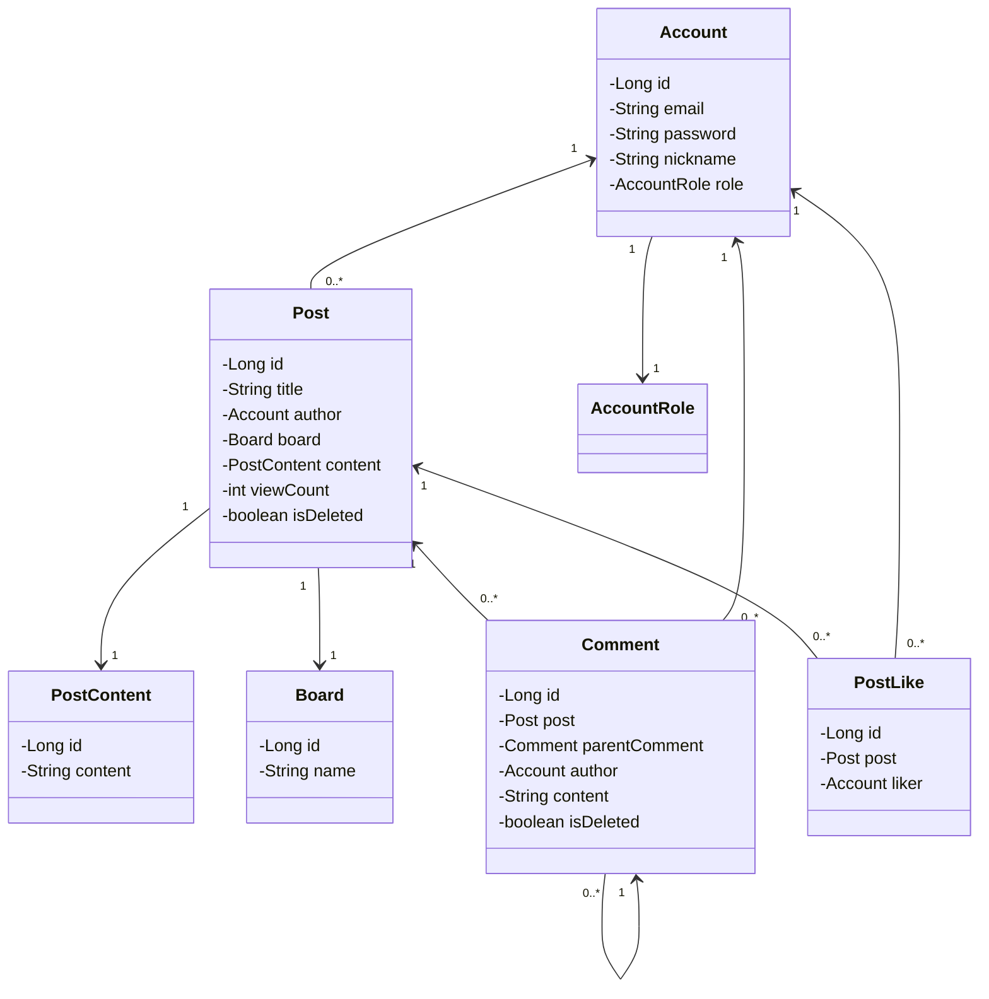

# Basic Board

## 소개

웹 개발의 기본이라 불리는 게시판 프로젝트입니다. 그 동안 독학으로 배웠던 기술들에 익숙해지고자 프로젝트를 시작했습니다.
이 프로젝트에서는 특히 Spring Security, Mybatis, jQuery, Bootstrap에 익숙해지고 싶었습니다.

### 1. 프로젝트 기능

- **Board**
  - Board 별 게시글 조회
- **Post**
  - CRUD
  - 좋아요, 조회수
- **Comment**
  - 무한 답글
- **Account**
  - 회원가입, 로그인, 로그아웃

### 2. 주요 사용 기술

**[백엔드]**

- Java 11
- SpringBoot 2.7.13
- Mybatis 2.3.1
- Spring Security 5.7.9

**[프론트엔드]**

- Html/Css
- jQuery
- Thymeleaf
- Bootstrap 5.2.3

### 3. 개발 기간

- 2023.06.28 ~ 2023.07.06

## 4. 상세 구현 내용

### 4.1 Board 별 게시글 조회

Board 페이지에서는 각 Board에 소속 된 Post 목록을 보여줍니다.
이 프로젝트에서는 "자유게시판"과 "FAQ"를 name으로 갖는 Board가 있습니다.

테이블의 각 Post는 로그인한 사용자가 해당 Post에 "좋아요"를 눌렀는지와 기본 Post 정보를 표시합니다.

### 4.2 Post CRUD

[게시글 조회]

[게시글 작성]

[게시글 수정]

[게시글 삭제]

이미지는 없지만, 삭제를 누르면 Post를 soft delet하여 조회 시에 제외합니다.

### 4.3 좋아요/조회수

PostLike 테이블에서 `post_id`와 `post_liker`를 묶어 Unique를 지정하여 "좋아요" 중복을 방지했습니다.

PostContent를 포함하여 조회 시에는 조회수가 증가하도록 했습니다.

### 4.4 무한 답글

백엔드에서는 복잡할 것 없이 자식 Comment가 부모 Comment의 Id를 fk로 보유하고, 댓글 조회 시 Post에 속하는 댓글을 전부 전달합니다.

Ajax로 comment 리스트를 받은 jQuery가 재귀적인 방식으로 comment를 정렬하여 표시합니다.

### 4.5 회원가입, 로그인, 로그아웃

> "회원가입, 로그인, 로그아웃"에 대한 이미지는 간단하게 `email`, `password`를 받는 형태여서 제외했습니다.
> 대신 각 기능이 어떤 식으로 구현되었는지 상세 설명을 남기겠습니다.

[회원가입]

입력된 email과 bcrypt로 암호화된 password를 저장합니다.

[로그인]

로그인은 form 방식을 사용하지 않고, ajax 방식으로 `email`, `password`를 전달하여 로그인하도록 했습니다. (학습 목적)

로그인은 다음의 순서로 인증이 진행 됩니다.

1. `AjaxLoginProcessingFilter`
  - 로그인 인증을 위해 입력 된 데이터 자체를 검증 후 `EmailPasswordAuthenticationToken`를 생성하여 인증을 진행합니다.
2. `AuthenticationManager`
3. `CustomAuthenticationProvider`
  - 3.1 인증 전의 `EmailPasswordAuthenticationToken`(Authentication)을 받습니다.
  - 3.2 `CustomUserDetailsService`로부터 로그인 정보를 포함하는 `CustomUserDetails`를 받아 로그인을 검증합니다.
  - 3.3 인증이 완료 된 새로운 `EmailPasswordAuthenticationToken` 생성합니다.
    
    -> 인증 후의 Authentication은 다른 클래스를 사용해도 좋을 듯 하지만, 이 프로젝트에서는 인증 전과 동일한 Authentication을 사용했습니다.

[로그아웃]

특정 URL(`/api/v1/logout-proc`)으로 Get 요청이 들어오면 세션과 세션 쿠키를 삭제합니다.

## 구조 및 설계

### 1. 패키지 구조

### 2. ERD

### 3. API