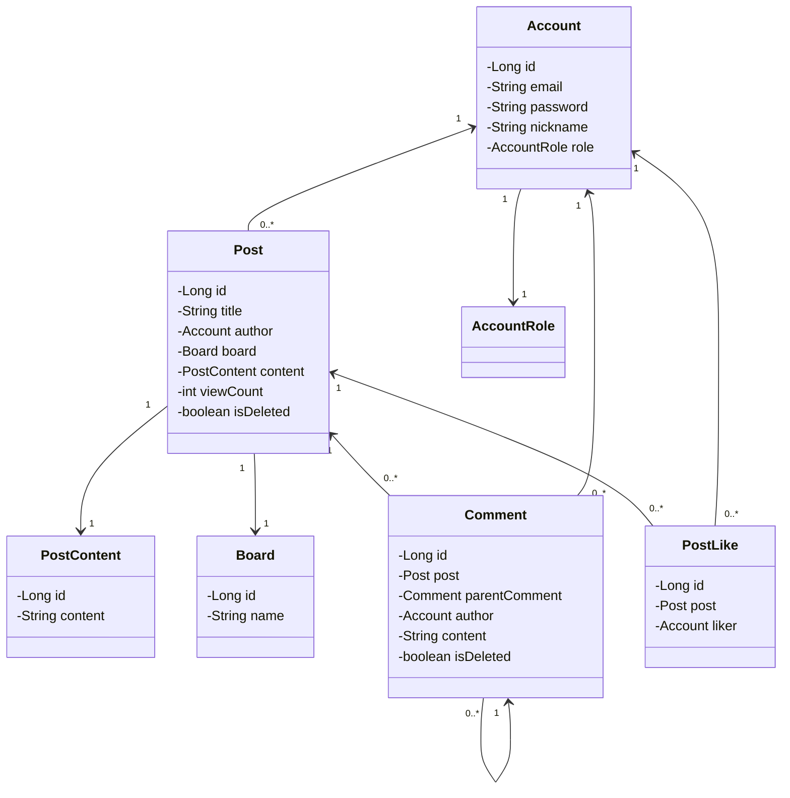

# Basic Board

## ERD

```mermaid
classDiagram
    class Account {
        -Long id
        -String email
        -String password
        -String nickname
        -AccountRole role
    }

    class Post {
        -Long id
        -String title
        -Account author
        -Board board
        -PostContent content
        -int viewCount
        -boolean isDeleted
    }

    class PostContent {
        -Long id
        -String content
    }

    class Board {
        -Long id
        -String name
    }

    class Comment {
        -Long id
        -Post post
        -Comment parentComment
        -Account author
        -String content
        -boolean isDeleted
    }

    class PostLike {
        -Long id
        -Post post
        -Account liker
    }

    Account "1" <-- "0..*" Post
    Account "1" <-- "0..*" Comment
    Account "1" <-- "0..*" PostLike
    Account "1" --> "1" AccountRole
    Post "1" --> "1" PostContent
    Post "1" <-- "0..*" Comment
    Post "1" <-- "0..*" PostLike
    Post "1" --> "1" Board
    Comment "1" <-- "0..*" Comment

```